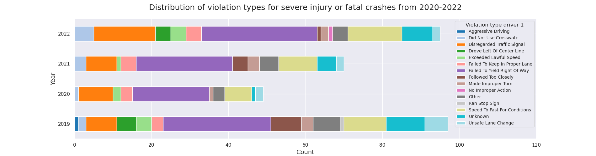

## 2 Where do accidents happen?
First, let's take a look at where crashes happen. Pictured below is an animated heat map of all crashes in each year between 2012-2022. Not surprisingly, most accidents occur on the largest roads with the largest volume of cars. Moreover, we see a clear trend of more crashes happening around intersections, traffic lights, or other road infrastructure.

<iframe src="contents/heatmap-video-plot.html"
    sandbox="allow-same-origin allow-scripts"
    width="100%"
    height="600"
    scrolling="no"
    seamless="seamless"
    frameborder="0">
</iframe>

To look into whether or not Vision Zero already has managed to bring traffic crashes down since its launch in 2019, we consider the total number of crashes occurring each year and the number of crashes causing fatality each year as shown below. Take a closer look at each year by hovering over the markers at the curves, and note that the curves are not scaled relative to each other:

<iframe src="contents/accidents_over_time.html"
    sandbox="allow-same-origin allow-scripts"
    width="100%"
    height="400"
    scrolling="no"
    seamless="seamless"
    frameborder="0">
</iframe>

From the graphs, we see a major drop in accidents in 2020, but then a steady increase in the two following years. This suggests that the observed trend is due to Covid-19 rather than the City of Tempe successfully improving the traffic infrastructure and regulations. As a matter of fact, the crashes with fatality has increased every year since 2019 despite the drop of total accidents.

Some of the changes already implemented by Vision Zero include: 
-  Speed limit changes 
-  Intersection improvements
-  Traffic safety devices installed around schools. 
As it is not disclosed exactly where most of these changes have been implemented, we will instead see if we can spot them by checking if a decrease in crashes is visible.

Pictured below are the locations of all crashes in Tempe colored according to their year (2012-2022).  The major schools and universities have been circled in **black**, and roads or intersections which appear to have become safer during the investigated time period are circled in cyan). The dots haven been jitted in the _sout-east_ direction by between -20m to 20m, as to minimize overlaps and improve clarity. 

Most schools are located near smaller roads with a low density of crashes. This makes it diffcult to draw any certain conclusions. However, dark blue dots signifying recent chrashes, appear near most schools. The most south-west school (Kyrene de las Manitas Elementary School) is the only school where there does not appear any recent crashes.

<iframe src="contents/map_plot_jitter_all_with_schools.html"
    sandbox="allow-same-origin allow-scripts"
    width="100%"
    height="800"
    scrolling="no"
    seamless="seamless"
    frameborder="0">
</iframe>

In general it appears that the only areas in which *no* recent crashes have occurred (only red dots are present) are along the borders of Tempe (see cyan circles). This seems highly suspicious. We have investigated whether or not the borders of Tempe or the police juristriction area have changed in recent years, but were unable to find any information. We did however manage to find multiple shapefiles for Tempe and when plotting them together it is clear that some borders have changed. On the below plot, the cyan dotted line illustrates a 2023 version of the Tempe borders, whereas the **black** line is an older border. Taking the point jittering into consideration, it is clear that South 48th Street only contains older crashes (red), as it is no longer considered part of Tempe.

<iframe src="contents/map_plot_jitter_all_with_multi_border.html"
    sandbox="allow-same-origin allow-scripts"
    width="100%"
    height="600"
    scrolling="no"
    seamless="seamless"
    frameborder="0">
</iframe>

LOOK into serious injury accidents:
