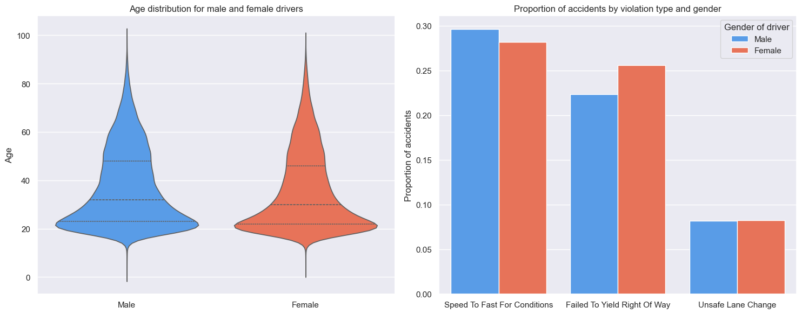

## 4 What causes accidents?
At last a closer look at factors causing the accidents on the road, where both characteristics of the drivers and external characteristics such as road infrastructure (e.g. intersection type) and light conditions are looked into. 

### 4.1 Characterisation of drivers
First, let us look at characteristics of the drivers regarding age and gender. Below to the left, we see a violin plot of the age distribution for male and female drivers. From this plot it can be seen that the age distribution is similar for both genders, with the majority of drivers involved in trafic accidents being of a younger age (16-25 years old). However, it is difficult to determine whether younger drivers are more frequently involved in accidents due to them constituting the majority of drivers of the roads in general, or due to other reasons (e.g. lack of driving experience, recklessness or other). Additionally, this plot has been generated based on all drivers, regardless of whether they were the primary cause of the accident or not.  

For the histogram to the right, only drivers that (primarily) *caused* the accident, as indicated by the report, are considered. In this plot, the propertion of accidents for the three most common violation types are seen for both genders, normalized with the total number of accidents within each gender. For both genders, the most common violation type is driving faster than allowed (speeding), however there is a slightly larger tendency for male drivers to do so than for female drivers. In terms of failing to yield right of way, the opposite is observed. Here, there is a significantly larger proportion of female drivers causing accidents due to this violation type. Thirdly is the unsafe lane change, in which the tendency is almost identical across the two genders. 

### 4.2 Most common violations

The top six violation types when considering accidents in the time period of 2012-2022 are:
1. Speed Too Fast For Conditions
2. Failed To Yield Right Of Way
3. Unsafe Lane Change
4. Unknown
5. Followed Too Closely
6. Disregarded Traffic Signal

The figure below shows the share of total accidents per year of each of the violation types above. Use the checkbox at the right to display or hide the desired violation types. The most common violation 'Speed Too Fast For Condition' has had an interesting devolopment during the period. From 2014-2017 speeding accounted for 40% of the accidents every year, and then dropped heavily the following two years. During the Covid-19 years with fewer cars on the road, the proportion of accidents related to speeding increased as well. Perhaps the fewer cars on the roads, allowed the drivers to drive without being hindered by traffic and thereby drove too fast more frequently. 'Disregared Traffic Signal' had an increasing proportion in accidents during Covid-19 as well, whereas the proportion of 'Unsafe Lane Change' decreased, which might also be due to fewer cars and therefore lower risk at endangering other drivers when changing lane. At last the violation 'Followed Too Closely' has had sensational increase from 2017 to 2018, but had has a decreasing trend throughout the rest of the period. It is not clear what have caused the increase in 2018, but possibble causes includes: police paying extra attention to these violations and drivers distracted by electronic devices.

As the list above shows, 'Unknown' is the fourth most common violation type, so the actual proportion of the specific violation types might be greater than visualized on the figure, but the tendencies are assumed to be reliable since the share of violation type marked 'Unknown' has been relatively constant throughout the period.

<iframe src="contents/ViolationType_interactive.html"
    sandbox="allow-same-origin allow-scripts"
    width="100%"
    height="600"
    scrolling="no"
    seamless="seamless"
    frameborder="0">
</iframe>

### 4.3 The influence of external conditions
Intersection type or 'straight'

road condition / light

### 5 Conclusion and recommendations

We have considered crash data from Tempe and looked into some of the early efforts made by project _Vision Zero_. Due to the influence of COVID-19 as well as the modest and very recent infrastructure changes made by the project, we have _not_ been able to identify any clear improvements in road safety as a result of _Vision Zero_.

Based on the above analyses, we have however arrived at a set of recommendations for drivers/pedestrians/cyclists and decision makers, which should improve overall traffic safety in Tempe.

For drivers/pedestrians/cyclists **we recommend to**:
- Pay extra attention when commuting home in the afternoon and avoid distractions such as mobile phones.
- Use crosswalks whenever possible and otherwise cross with care.
- Use public transport or taxis at night to avoid falling into the temptation of drunk driving (on all days of the week)
- Take extra care in educating and supervising young drivers in the family throughout their 20s.

For decision-makers **we recommend to**:
- Collect data on traffic volume on major roads. This will remove significant bias from the above analyses and allow for better identification of which roads/intersections are most problematic in terms of 'crashes per X volume traffic'.
- Learn from other Vision Zero projects. Vision Zero was as an example already implemented in 2014 in New York. Tempe could look into which infrastructure and legislation changes proved most effective in other similar cities.
- Increase fines for speeding as this is the number one cause of crashes
- Invest heavily in 'duty to yield intersections' as _failed to yield right of way_ causes the most severe injury/fatal crashes. This could include both improving current infrastructure, such as adding full-stop signs in addition to shark-teeth, or changing the intersection type completely.